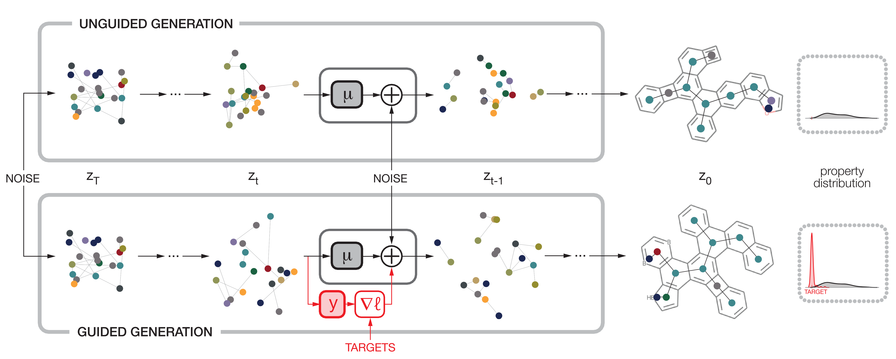

# Section 5.2: Equivariant Diffusion Models For Materials Design

This directory contains the code for the experiments with equivariant diffusion models applied to materials design, as described in Section 5.2 of the paper. The code is based on the work of Weiss et al., Nat Comput Sci 3, 873–882 (2023), which is available at https://gitlab.com/porannegroup/gaudi. The original README is included below.

The following instructions provide a step-by-step guide to running the code and reproducing the experiments from our paper.

>Note: The guidance model's forward pass does currently not use an explicit time-step argument. This is unintentional, however, we expect this to have a negligible effect on model capacity. The EGNN predictor conditions on the time-step by appending it as an input feature. Since inferring t from x_t is straightforward, the lack of an explicit argument is unlikely to significantly affect model expressivity.

### 1. Environment Setup

The code uses the Python 3.8 environment provided by Weiss et al. and a handful of additional packages. To install the required dependencies, run the following command:

```
conda env create -n <env_name> --file environment.yml
conda activate <env_name>
```

### 2. Data Pre-processing

The datasets can be downloaded by following the instructions in the original README. Alternatively, a utility SLURM script to download the data is provided in `data/datasets/get_data.sh`. Since the original dataset does not provide the clustered splits used in the paper, an updated index file is provided at `data/datasets/COMPAS-1x_reduced.csv`. Please update the corresponding path in the `get_paths@data/aromatic_dataloaders.py` and `generation_guidance.py` scripts accordingly. The code to run the clustering and derive the splits is provided in `get_cluster_splits.ipynb`.  

### 3. Training the Equivariant Diffusion Model (EDM)

To train the EDM, run the following command:

```
python train_edm.py --arg_id <arg_id> --name <edm_run_name>
```

where `<arg_id>` denotes which dataset the model is trained on. `<arg_id>=1` denotes the training set of the cluster split used in the paper and mentioned above, while `<arg_id>=0` denotes a randomly sampled subset of the same size. To reproduce the main experimental results from the paper, only running `python train_edm.py --arg_id 1` is sufficient. The trained model will be saved in `diffusion_training/<run_name>`. A utility SLURM script to train EDMs on both splits with a batch job is provided in `diffusion_model_training.sh`. 

### 4. Training the Guidance Model

To train regression models for guiding the sample trajectories of the unconditional model, run the following command:

```
python train_guidance_model.py --arg_id <arg_id> --hyper_id <hyper_id> --name <guidance_model_run_name>
```

Here, `<arg_id>` denotes which `data split x regularization type x context set` combination the model is trained on:

| arg_id |  data split   |     context set     | regularization type |
|--------|---------------|----------------------|---------------------|
|   0    | random split  | reduced context set | ours |
|   1    | random split  | full context set    | ours |
|   2    | random split  | n/a | L2 regularizaton |
|   3    | random split  | n/a | weight decay |
|   4    | cluster split | reduced context set | ours |
|   5    | cluster split | full context set    | ours |
|   6    | cluster split | n/a | L2 regularizaton |
|   7    | cluster split | n/a | weight decay |


To reproduce the main experimental results from the paper, only using the `arg_id` range {4, 5, 6, 7} is sufficient. The `hyper_id` argument specifies which element of the hyperparameter search grid is used for a given run. Once training runs with all hyperparameter options are complete, the script automatically selects the hyperparameter combination with the best performance on the validation set and re-trains ten independent models with different random seeds. All results and model checkpoints are saved under `standard_regression/<run_name>`. A utility SLURM script to train guidance models on all relevant `arg_id x hyper_id` combinations with a batch job is provided in `guidance_model_training.sh`.

### 5. Conditional Generation Using Guided Diffusion

Once the EDM and guidance models have been trained, they can be combined to generate molecules with desired properties by calling 
```
python generation_guidance.py --arg_id <arg_id> --gen_run_name <gen_run_name> --name_cond_predictor_run <guidance_model_run_name> --name_edm_run <edm_run_name>
``` 

Here, <arg_id> refers to the same `data split x regularization type x context set` mapping as in the previous section and <guidance_model_run_name> and <edm_run_name> can be used to specify the names of the guidance model and EDM runs, respectively. The script will generate molecules with the desired properties and save the results in `generated_molecules/<gen_run_name>`. A utility SLURM script to generate molecules with all relevant `arg_id` combinations is provided in `generate_mols.sh`.

### 6. Analysis and Model Comparisons

The resulting samples can be analyzed and compared with the notebooks in the `analyse_results` directory. The `generated_props.ipynb` notebook is used to generate the result plots provided in the paper, while the `ratio_of_samples_in_each_split.ipynb` notebook analyses the distribution of generated samples across the training, validation, and test splits.

---

# Guided Diffusion for Inverse Molecular Design

The holy grail of material science is \emph{de novo} molecular design -- i.e., the ability to engineer molecules with desired characteristics and functionalities. In recent years, we have witnessed advances in two directions: first, in the ability to predict molecular properties using models such as equivariant graph neural networks; second, in the performance of generation tasks and especially in conditional generation, such as text-to-image generators and large language models. Herein, we combine these two achievements to introduce a guided diffusion model for inverse molecular design, a generative model that enables design of novel molecules with desired properties. We use newly-reported data sets of polycyclic aromatic systems to illustrate the method's effectiveness for a variety of single- and multiple-objective tasks. We demonstrate that the method is capable of generating new molecules with the desired properties and, in some cases, even discovering molecules that are better than the molecules present in our data set of 500,000 molecules.



For more information, refer to our paper *Guided Diffusion for Inverse Molecular Design* (preprint) 
https://chemrxiv.org/engage/chemrxiv/article-details/642c221aa029a26b4ce5d696


## Clolab notebook
You can try our method and use it generate molecules with your own target function - [Colab](https://colab.research.google.com/drive/1BgiSjMLuFwCNyfUiV7x1GCvnrenidbtu?usp=sharing).  

## Setup
1. Clone this repository by invoking
```
git clone https://github.com/tomer196/GaUDI.git
```
2. Download datasets (`csv` + `xyz`s) from:  
  a. cc-PBH dataset from [COMPAS](https://gitlab.com/porannegroup/compas).  
  b. PASs dataset from [link](https://zenodo.org/record/7798697#.ZCwls-zP1hE).  
3. Update `csv` + `xyz`s paths in `get_paths@data/aromatic_dataloaders.py`.
4. Install conda environment. The environment can be installed using the `environment.yml` by invoking
```
conda env create -n GaUDI --file environment.yml
```
Alternatively, dependencies can be installed manually as follows:
```
conda create -n <env_name> python=3.8
conda activate <env_name>
conda install pytorch=1.10 cudatoolkit=<cuda-version> -c pytorch
conda install rdkit
pip install matplotlib networkx tensorboard pandas scipy tqdm imageio
```

## Usage
First, we need to train the unconditioned diffusion model (EDM) and the time-conditioned 
property prediction model.

### Training
1. To train the EDM, set the required configuration in `utils/args_edm.py` and run:
```
python train_edm.py
```
This will take 4 hours to train on a single GPU for the cc-PBH dataset. The logs and trained model will be saved in `<save_dir>/<name>`.  

2. To train the predictor, set the required configuration in `cond_prediction/prediction_args.py` and run:
```
python cond_prediction/train_cond_predictor.py
```
The logs and trained model will be saved in `<save_dir>/<name>`. 

### Validity evaluation
To evaluate stability of the unconditional diffusion model,
updatie the experiment name in line 128 of `eval_validity.py` and run:
```
python eval_validity.py
```
Results should be as the results in Table 1 in the paper.


### Conditional generation using guided diffusion
Finally, we can start designing molecules using the guided diffusion model. In order to sample from the guided model, follow these steps:

1. Configure the paths to the diffusion model and the time conditioned prediction model 
in `generation_guidance.py` lines 227 and 228.
2. Set the gradient scale and number of desired molecules - lines 189-191.
3. Define a target function - line 198.
4. Run:
```
python generation_guidance.py
```
When finished, a summary of the results will be printed to `stdout` and the 5 best generated molecules will be saved in `<save_dir>/<name>`. 

## Notes

Testd on Ubuntu 20.04 with the following libarys varsions:
`pytorch=1.10, matplotlib=3.7.1, networkx=3.0, tensorboard=2.9.1, pandas=1.4.1, scipy=1.10.1`

Equivariant diffusion model (EDM) code provided here includes portions of the code by Emiel Hoogeboom, Victor Garcia Satorras, Clément Vignac
from 
```
https://github.com/ehoogeboom/e3_diffusion_for_molecules
```
distributed under the MIT license. For more information, refer to the license file in `./edm`.


